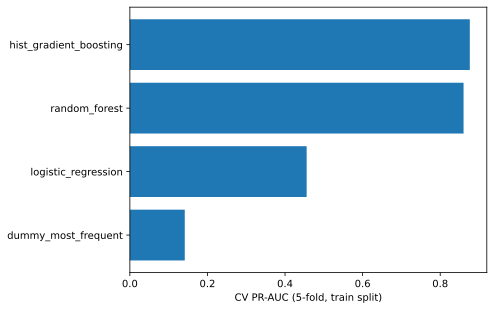
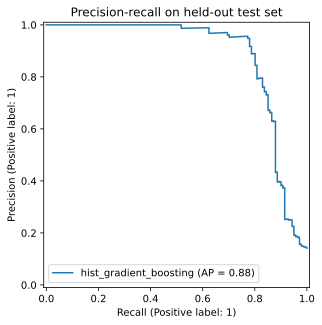

# Customer Churn Prediction: training, evaluation and a served API

An end-to-end ML project: compare models with cross-validation, evaluate once on a held-out set, and serve the best model behind a tested FastAPI endpoint (Docker + CI included).

**Data:** [OpenML churn dataset (id 40701)](https://www.openml.org/d/40701): 5,000 telecom customers, 19 features, 14.1% churn.

## Results (all numbers produced by `python -m src.train`, see `reports/metrics.json`)

Stratified 5-fold CV on the 4,000-row training split:

| Model | ROC-AUC | PR-AUC | F1 |
|---|---|---|---|
| Dummy (class prior) | 0.500 | 0.142 | 0.000 |
| Logistic regression | 0.826 | 0.456 | 0.491 |
| Random forest | 0.915 | 0.860 | 0.802 |
| **HistGradientBoosting** | **0.922** | **0.876** | **0.844** |

Held-out test set (1,000 rows, touched once, threshold 0.465 chosen from out-of-fold training predictions):

| ROC-AUC | PR-AUC | Precision | Recall | F1 |
|---|---|---|---|---|
| 0.929 | 0.880 | 0.917 | 0.787 | 0.847 |

PR-AUC is the headline metric because the classes are imbalanced (a model that always says "no churn" gets 86% accuracy and zero recall).




## Engineering choices
- Preprocessing lives inside a scikit-learn `Pipeline`, so training and serving use identical transforms and CV has no leakage.
- Model selection uses CV only; the test split is used once for the final report.
- The decision threshold is tuned on out-of-fold predictions, not on the test set.
- Input validation with Pydantic (missing fields return HTTP 422).
- `phone_number` is dropped as an identifier. Categorical columns (state, area code, plans) are one-hot encoded. In this OpenML version `state` is an anonymised code.

## Run it
```bash
pip install -r requirements.txt
python -m src.train          # trains, writes models/ (git-ignored) and reports/
python -m pytest -q          # API tests
uvicorn src.app:app --port 8000
curl localhost:8000/health
```
`POST /predict` takes the 19 customer fields (see `tests/test_api.py` for a sample) and returns `churn_probability` and `will_churn`.

Docker (the image trains the model at build time): `docker build -t churn-api . && docker run -p 8000:8000 churn-api`

## Limitations
Single public dataset, one random split (no time-based split), no probability calibration or drift monitoring. These are the next steps for a real deployment.
